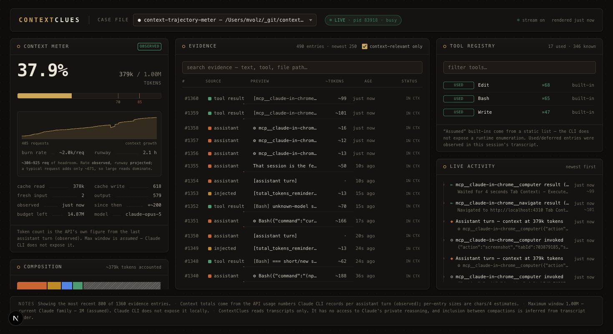

# ContextClues 🔎

[](https://github.com/MaxwellVolz/contextclues/actions/workflows/ci.yml)
[](https://www.npmjs.com/package/contextclues)
[](LICENSE)
[](https://nodejs.org)

A local, dark, forensic-style developer dashboard that reveals what a running **Claude CLI
(Claude Code)** session currently has in context: how full the context window is, what's in it,
which tools are enabled, and what just happened — live.

ContextClues treats each session as a **case file**, context entries as **evidence**, and its
observations as **clues**.



## What it shows

| Panel | Contents |
|---|---|
| **Context Meter** | Tokens in the window (the API's own count from the last assistant turn), % of max, cache read/write breakdown, session token budget, staleness of the observation. |
| **Context Trajectory** | Inside the meter: a curve of context growth across the session's model requests, plus **burn rate** and projected **runway** — how much headroom is left, in time and in requests. Compaction boundaries are marked; hover for any point. |
| **Composition** | Stacked breakdown by source: user messages, assistant replies, tool results, injected context, compaction summaries, system events, and the inferred system-prompt/tool-schema overhead. |
| **Evidence** | Every transcript record, searchable, with estimated tokens, age, inclusion status (`in context` / `compacted out` / `not sent`), and *why* each entry is believed to be there. Click a row for details. |
| **Tool Registry** | Every known tool with provider (built-in / MCP server / skill / plugin), status (used / active / deferred / configured / assumed), source of that knowledge, and use counts. |
| **Live Activity** | Tool calls, file reads, tool results, compactions, hook injections, and tool-availability changes, streaming in as they happen. |
| **Clues** | Actionable observations: oversized tool results, files loaded repeatedly, compaction events with exact token drops, unused enabled tools, window pressure, stale heavy evidence. |

## Install & run

Requires **Node.js ≥ 22.5** (uses the built-in `node:sqlite`, so there are no native builds) and
a machine where Claude CLI has run (it reads `~/.claude`).

```bash
npx contextclues          # → http://localhost:4310
```

Run Claude CLI in another terminal; ContextClues auto-detects the active session (live sessions
are marked ●) and updates in real time as the transcript grows.

Install it permanently if you prefer:

```bash
npm install -g contextclues
contextclues
```

### CLI options

```
-p, --port <n>    Port to listen on (default 4310)
-H, --host <h>    Host to bind (default 127.0.0.1, loopback only)
    --no-open     Do not open a browser on start
-v, --version     Print version
-h, --help        Show this help
```

The server binds the loopback interface by default, so a dashboard of your transcripts is never
reachable from the local network.

### From a clone (for development)

```bash
git clone https://github.com/MaxwellVolz/contextclues.git
cd contextclues
npm install
npm run dev        # → http://localhost:4310
```

```bash
npm test           # parser, redaction, estimator, clue engine, collector, SQLite, case-file
npm run build      # production build
npm start          # serve the production build on :4310
```

Environment overrides: `CONTEXTCLUES_CLAUDE_DIR` (default `~/.claude`),
`CONTEXTCLUES_DATA_DIR` (default `~/.contextclues`).

## How it works

```
~/.claude/sessions/*.json ──┐  chokidar (read-only)  ┌─ SQLite (node:sqlite, ~/.contextclues/)
~/.claude/projects/**.jsonl ├────▶ collector ────────┤
~/.claude.json, settings,   │  inside the Next.js    └─ event bus ─▶ SSE /api/stream ─▶ UI
.mcp.json, plugins, skills ─┘  server process
```

- **Session detection**: Claude CLI maintains `~/.claude/sessions/<pid>.json` for each running
  process (session id, cwd, name, status). ContextClues cross-checks pid liveness and locates the
  transcript (`~/.claude/projects/…/<sessionId>.jsonl`) by filename search.
- **Collection**: transcripts are tail-parsed incrementally (byte offset per session) and indexed
  into SQLite. Claude's files are opened read-only and **never modified**.
- **Live updates**: a Server-Sent Events stream notifies the UI whenever new lines are ingested.
- **Why not hooks?** Claude Code hooks would push events, but installing one modifies user
  configuration, which this project refuses to do automatically. See `DISCOVERY.md` for the full
  investigation of what Claude CLI exposes locally.

## Where the numbers come from

Every number carries a confidence label:

- **observed** — read directly from Claude CLI artifacts: per-turn API `usage` counts
  (`input + cache_read + cache_creation + output`), compaction records with exact pre/post
  tokens, tool-availability deltas. The growth curve and burn rate are observed.
- **estimated** — chars ÷ 4 heuristics for per-entry sizes.
- **inferred** — derived indirectly, e.g. system-prompt overhead = observed total − sum of
  estimates. The **runway is inferred**: it extrapolates observed data forward, so the UI
  says "projected", never "will".
- **assumed** — static mappings that cannot be verified locally (model → context window).

### How burn rate and runway are computed

Growth per model request is strongly right-skewed — most requests add a little, an
occasional large file read adds a lot. Runway is a question about *cumulative* growth, and
`E[sum] = n × E[delta]`, so the **mean** over a 30-request window drives the projection: it
counts large requests at the frequency they actually occur. A median would describe a
typical request while systematically under-predicting how fast the window fills, which is
why the panel reports both — when the average sits far above the typical request, the
session is spike-dominated and the panel says so, widening the runway into a range.

A "request" is one API call. A single conversational exchange is usually several of them,
because every tool-loop iteration is its own request with its own usage record.

ContextClues never claims access to Claude's hidden reasoning. Inclusion between compactions is
inferred from transcript order and labeled as such; records preserved or dropped by compaction
are labeled from the CLI's own compaction metadata.

## Privacy

- Everything stays on your machine. No cloud services, no auth, no telemetry.
- Likely secrets are redacted **before** previews are stored or rendered: vendor API keys
  (Anthropic, OpenAI, Google, Stripe, AWS, GitHub, GitLab, Slack, npm, HuggingFace), JWTs,
  bearer headers, private-key blocks, passwords embedded in connection strings, and
  secret-looking assignments. See `lib/redact.ts`; `test/redact.test.ts` covers each format.
- ContextClues' own state lives in `~/.contextclues/` — delete it at any time; it rebuilds from
  the transcripts.
- The server binds `127.0.0.1`, so nothing is exposed to your local network.

## Project layout

```
lib/        registry, transcript parser, collector, SQLite, case-file builder, clue engine, redaction
app/        Next.js App Router: dashboard page + /api/cases, /api/case/[id], /api/stream (SSE)
components/ dashboard panels (meter, composition, evidence, tools, activity, clues)
test/       node:test suites (135 tests) + shared transcript fixtures
DISCOVERY.md  what Claude CLI actually exposes locally (verified, not assumed)
PLAN.md       implementation plan
```

## License

MIT. See [LICENSE](LICENSE).
